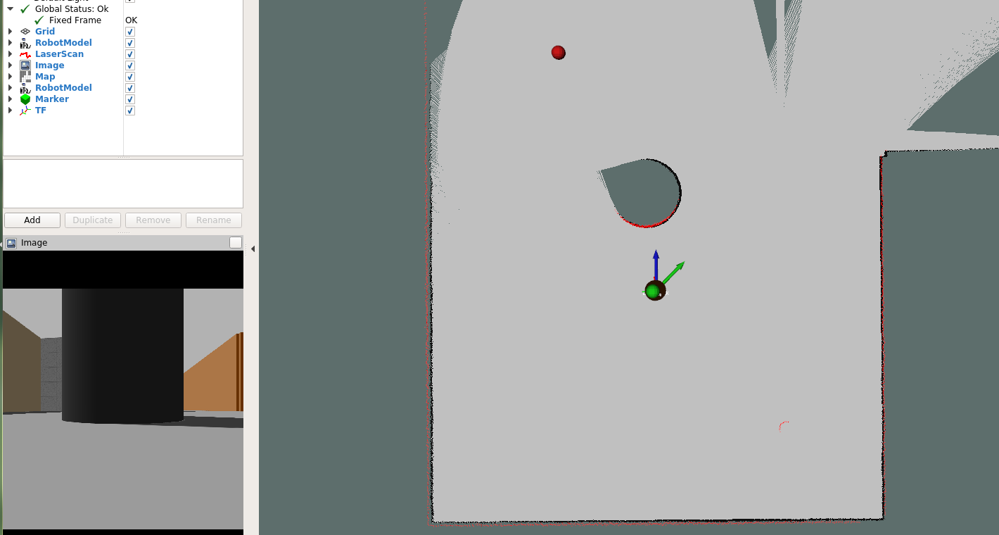

# goselo-ros #

This is a repository for a ROS implementation of the paper "*GOSELO: Goal-Directed Obstacle and Self-Location Map for Robot Navigation using Reactive Neural Networks.*" IEEE Robotics and Automation Letters (RA-L), Vol.3, Issue 2, pp.696-703, 2018. (presented in ICRA'18) by Asako Kanezaki, Jirou Nitta and Yoko Sasaki. 



# How to use:
1. Open up a shell, clone the repo.
```
git clone https://github.com/mohamedelsayed95/goselo-ros.git
```
2. Compile the packages and source the compiled files
```
catkin_make
source devel/setup.bash
```
3. Run the robot environment with gmapping and rviz:
```
./run_nav_with_rviz.sh 
```
4. Run the goselo ecosystem that generate goselo maps, run the network, and visualize the output on Rviz
```
roslaunch deep_planner goselo_ecosystem.launch
``` 
5. Run the robot move base that can move the robot to the goal
```
roslaunch deep_planner move_base.launch 
```

## Parameter Tuning:
Simply through `goselo_params.yaml` file, you can easily change the behavior of the robot.
```
# General Parameters
n_directions: 8
down_scale: 10
goalThreshold: 0.1

# Yaw Server Parameters:
yawThreshold: 0.1
Pgain: 1.5
Igain: 0.0
Dgain: 0.0

# Move Base Parameters:
linearSpeed: 0.3
linearWhileRotating: 0.05
object_avoidance_range: 1.0

# Model Definition:
model_def: '/home/ros/models/deploy.prototxt'
pretrained_model: '/home/ros/models/goselo_invisible.caffemodel'
```